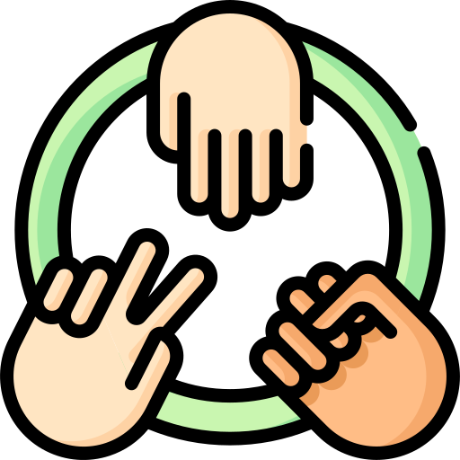

<!-- Improved compatibility of back to top link: See: https://github.com/othneildrew/Best-README-Template/pull/73 -->
<a name="readme-top"></a>
<!--
*** Thanks for checking out the Best-README-Template. If you have a suggestion
*** that would make this better, please fork the repo and create a pull request
*** or simply open an issue with the tag "enhancement".
*** Don't forget to give the project a star!
*** Thanks again! Now go create something AMAZING! :D
-->


<!-- PROJECT SHIELDS -->
<!--
*** I'm using markdown "reference style" links for readability.
*** Reference links are enclosed in brackets [ ] instead of parentheses ( ).
*** See the bottom of this document for the declaration of the reference variables
*** for contributors-url, forks-url, etc. This is an optional, concise syntax you may use.
*** https://www.markdownguide.org/basic-syntax/#reference-style-links
-->

[![LinkedIn][linkedin-shield]][linkedin-url]


<!-- PROJECT LOGO -->
<br />
<div align="center">
  <a href="https://github.com/othneildrew/Best-README-Template">
    
  </a>

  <h3 align="center">Rock-Paper-Scissors</h3>

  <p align="center">
    A neural network that is almost the winner all the times you play with
    <br />
    <a href="https://medium.com/@m.hassani4951383/create-100-winner-ai-in-rock-paper-scissors-against-you-by-neural-network-08eabe382462"><strong>Explore the docs »</strong></a>
    <br />
    <br />
    ·
    <a href="https://github.com/mahdihassani-dev/Rock-Paper-Scissors/issues/new?labels=bug&template=bug-report---.md">Report Bug</a>
    ·
    <a href="https://github.com/mahdihassani-dev/Rock-Paper-Scissors/issues/new?labels=enhancement&template=feature-request---.md">Request Feature</a>
  </p>
</div>


<!-- ABOUT THE PROJECT -->
## About The Project

![Product Name Screen Shot][product-screenshot]

extract landmarks from hand in a frame, use it as the input of the model and predict which game gesture does It show and based on that show the ai move to be the winner all the times

<br />


## Prerequisites

the main libraries used in this project are opencv-python, mediapipe and tensorflow using python version 3.11.5 64bit
* install libraries
  ```py
  pip install requirements.txt
  ```

<br />


## CollectDataset

_To create your own dataset you can simply connect your webcam and use CollectingDataset.py file to capture your hand in each gesture and at the end have 5000 pictures of each one._

* run in terminal
   ```
   python collectingDataset.py
   ```

you may want to change the number of each gesture pictures from 5000 to anything else.so just change this line :

* Count of each gesture image
   ```python
     IMG_SIZE = 5000
   ```


betterDatasetTip : try to change your rotate when capturing your hand in each game gesture to have better and more complete dataset

if you want prepared dataset you can use <a href="https://www.kaggle.com/datasets/mahdihassani83/rock-paper-scissors-points">mine</a>

<br />


## Train

_After providing dataset you can simply use **train.ipynb** file to train your neural network and save your model._

my model is also availabe <a href="https://www.kaggle.com/models/mahdihassani83/rock-paper-scissors-model">here</a>.you can download and enjoy It :)

<br />

## Test

_After providing your model you could connect your webcam and run test.py file to test your model._

my model is also availabe <a href="https://www.kaggle.com/models/mahdihassani83/rock-paper-scissors-model">here</a>.you can download and enjoy It :)

* run in terminal
   ```
   python test.py
   ```


<!-- MARKDOWN LINKS & IMAGES -->
<!-- https://www.markdownguide.org/basic-syntax/#reference-style-links -->
[linkedin-shield]: https://img.shields.io/badge/-LinkedIn-black.svg?style=for-the-badge&logo=linkedin&colorB=555
[linkedin-url]: https://www.linkedin.com/in/mahdi-hassani-939602255/
[product-screenshot]: demo/play.gif
